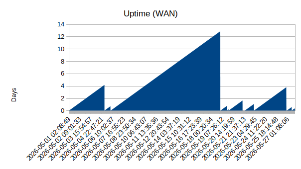

## Uptime monitor

`./uptime.sh`

Every 60 seconds:

* Check IP address

* Log uptime to file

* If no IP address, reset uptime to zero

## IP change detection

As a byproduct, we can also update DNS records automatically.

#### Cloudflare

`cp .env.example .env` and replace values with your API keys and domain info.

#### Others

* Additional plugins may be created for other DNS providers
